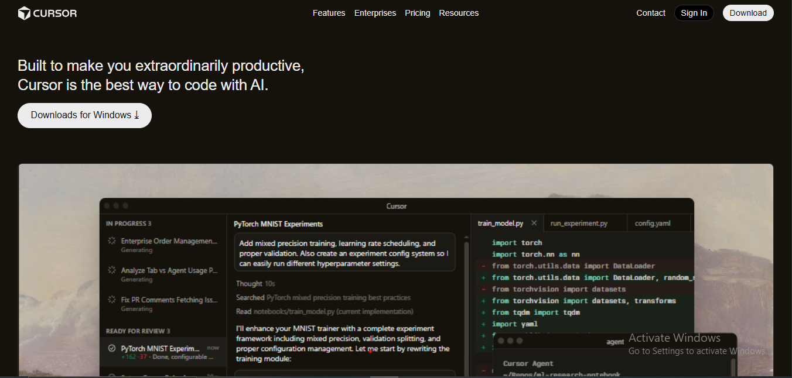
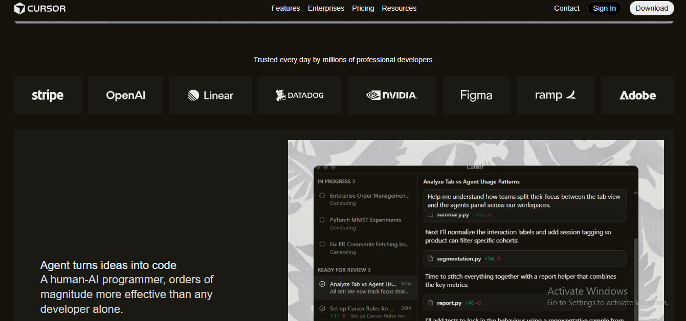
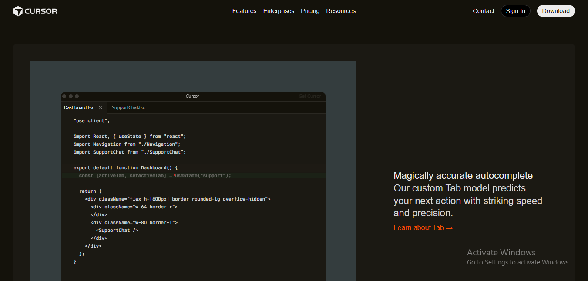
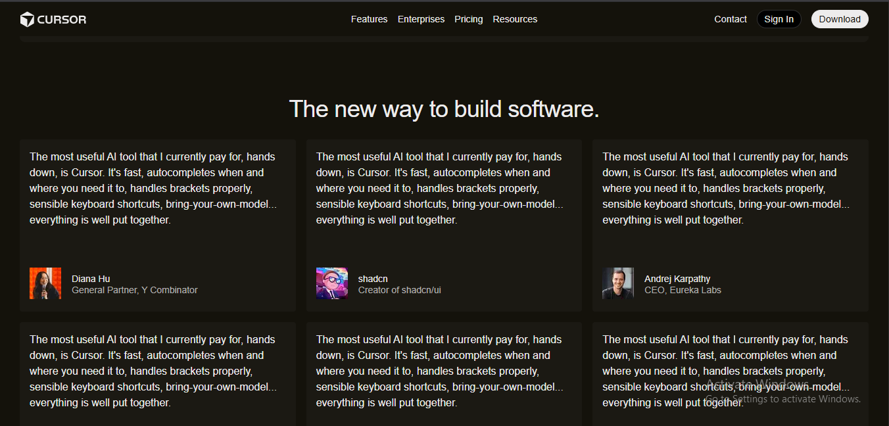
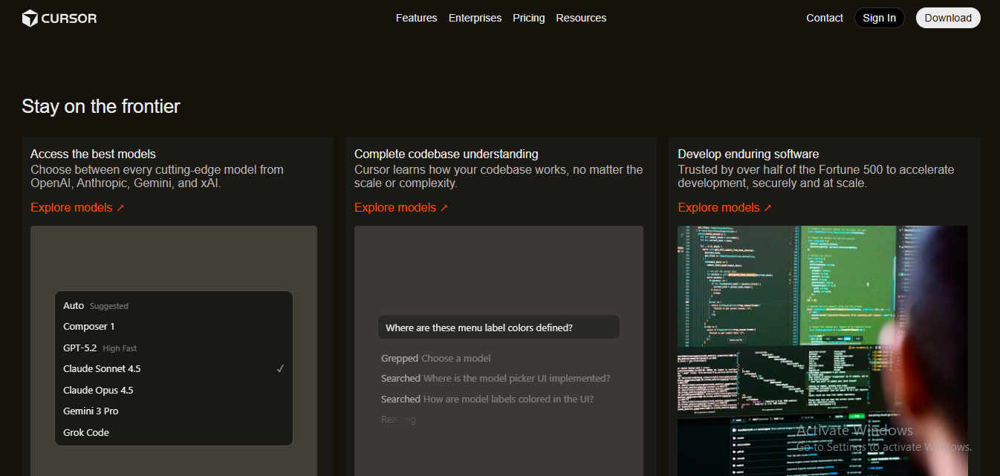

## Overview
This project is a clone of the Cursor.ai landing page,built from scratch using only semantic HTML5 and modern CSS3. The aim of this project is to create a like to like replication of cursor's landing page.

## Live Project Link
https://cursor-landing-page-clonee.netlify.app/

## Key Features

1. Created in a deep, high-contrast dark theme to give a a premium developer tool feel.
2. Create a responsive header with call-to-action buttons.
3. Creates a central hero element that simulates the IDE interface.
4. Use of a modular grid (CSS Grid) to showcase comapny logos, ai agents, and big developers testimonials in a very organized manner.
5. Created a clean, structured footer layout organizing important links and company information in a balanced grid.

## Technologies Used

1. HTML 5
2. CSS3
3. CSS Grid & Flexbox

## Setup Steps

1. Step 1 :- Clone the Project or Download the project folder to your computer and unzip it.

2. Step 2 :- Open the folder and look for the file named index.html.

3. Step 3 :- Right-click on index.html file and open it with any browser.

## Screenshots

## Screenshot 1 :

## Screenshot 2 :

## Screenshot 3 :

## Screenshot 4 :

## Screenshot 5 :

## Screenshot 6 :

